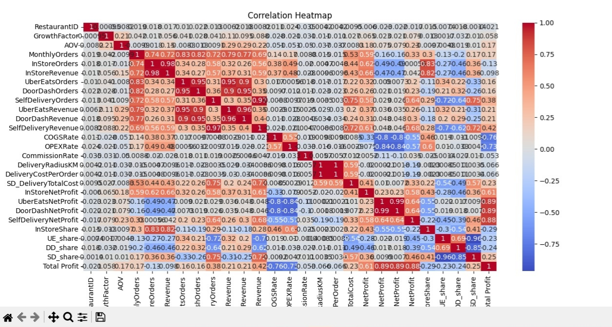
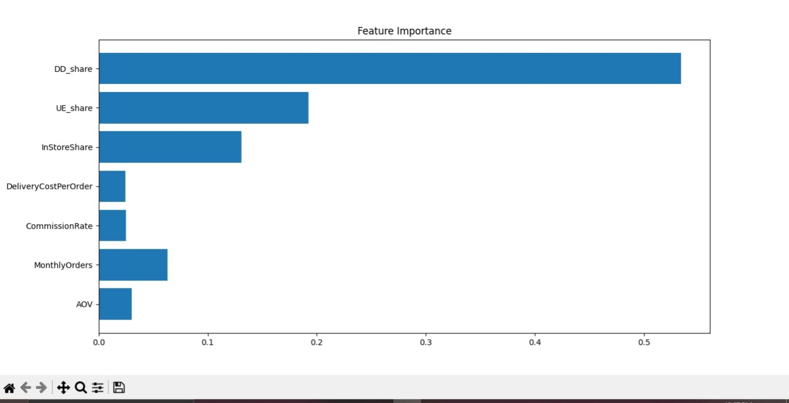
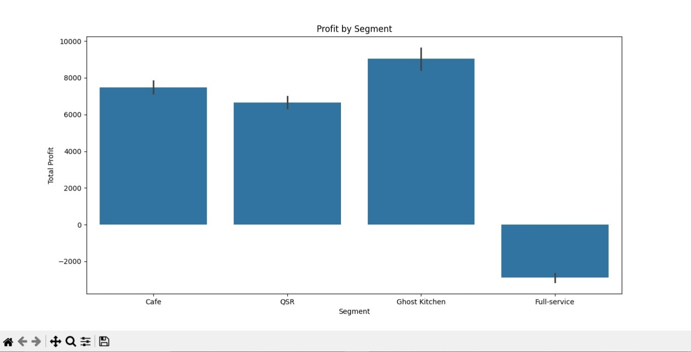

# 🍽️ Restaurant Profit Optimization

## 📌 Overview
This project predicts and optimizes restaurant profit across multiple channels using machine learning.

## 📊 Visualizations

### Correlation Heatmap


### Feature Importance


### Profit vs Orders


### Profit by Segment


## 🤖 Model
XGBoost Regressor used for prediction.

## 📈 Results
- Identified key drivers of profit  
- AOV significantly impacts profit  
- High commission reduces profitability  
- Optimal pricing improves total profit  

## 🚀 Run Project
```bash
streamlit run app.py
```

## 📎 Author
Jones Wesley

